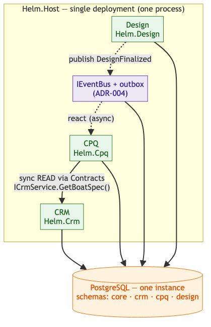
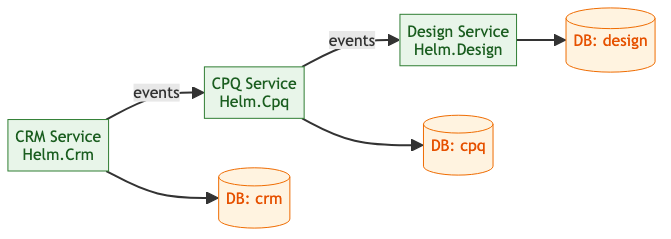

<!-- Source: https://ntg-sailmaking.atlassian.net/wiki/spaces/NTGHELM/pages/2064806/ADR-001+Modular+Monolith+Architecture (v7, exported 2026-07-06) -->

# ADR-001: Modular Monolith Architecture

**Status**: Ready for Review
**Proposed by**: Vu Lam · 2026-06-16
**Contributors**: Mike Probyn-Skoufa, Toby Moxham, Vu Lam
**Approved by**: — · pending
**Links**: [ADR-002](ADR-002-postgresql-per-module-schemas.md), [ADR-004](ADR-004-async-messaging-and-outbox.md), [ADR-009](ADR-009-monorepo-nx.md), [Architecture Overview](../architecture/overview.md)

---

## Context

The team needs to choose a backend architecture for the new Helm system. The existing CS system is a poorly structured monolith (4M+ LOC, multiple languages, everything tightly coupled through stored procedures and a shared DB). It is extremely difficult to change and deploy. The alternative extreme — a microservices architecture — was discussed but raises concerns about development overhead for a small team.

Key constraints:

- Small development team (2–3 engineers)
- Fast initial delivery is critical (Doyle cutover is the first milestone)
- System must be maintainable long-term without growing into another CS
- Future possibility of scaling individual modules independently

## Decision

Build Helm as a **modular monolith**: a single deployable application with hard internal module boundaries enforced through code structure and schema isolation. Each domain module is a self-contained C# project with its own database schema. Modules communicate in-process for now, with the expectation that high-load or independently-scaling modules can be extracted into separate services later with minimal rework.

### Visual — Modular Monolith (Now)

**Now — modular monolith** (single process, in-process calls via Contracts, one PostgreSQL with isolated schemas):

## Rationale

A microservices architecture up front would add significant overhead (service discovery, distributed tracing, network failure handling, per-service CI/CD) before the business logic is even understood. A modular monolith gives deployment simplicity now while preserving the exit ramp to microservices later — provided the module boundaries are strict from day one.

The key lesson from CS is not “monoliths are bad” — it’s that **lack of internal boundaries** created the mess. A monolith with well-enforced schema isolation avoids the same trap.

## Consequences

**Good:**

- Single deployment, simple CI/CD, easy local development
- Low operational complexity for a small team
- Module boundaries enforced by structure (own project, own schema) without network overhead
- Extracting a module to a microservice later is straightforward if schemas are clean

**Bad / watch out for:**

- Shared process means a bug in one module can crash everything — good error handling and health checks matter
- Temptation to take shortcuts and cross schema boundaries directly; must be actively resisted in code review
- As the team grows, parallel work on the same deployable can cause merge contention
- All modules scale together — can’t independently scale just the hot module (until extraction)
- Deployment couples all modules — a breaking change in one module affects deployment of all

## Cross-Module Communication Convention

Modules talk to each other in **two distinct ways** — these are complementary, not alternatives. Pick by intent:

| Intent | Mechanism | Why |
| --- | --- | --- |
| **Read** another module’s data to continue the current operation (“I need the answer now”) | **Synchronous call** via the owning module’s Contracts interface (`ICrmService.GetBoatSpec(id)`) | Caller needs an immediate, consistent answer; simplest correct option while one process |
| **React** to something that happened (“this is a fact; others may care”) | **Asynchronous domain event** via the outbox + `IEventBus` ([ADR-004](ADR-004-async-messaging-and-outbox.md)) | Publisher doesn’t know or wait on subscribers; keeps each module a single transaction boundary; multi-instance-safe |

So a query that blocks the caller → sync Contracts call. A notification that fans out to side effects (e.g. `DesignFinalized` → Inventory reserves cloth, Planning schedules) → event. **Cross-module writes go through events, never a synchronous “reach in and write” call** — that would create a distributed transaction and re-couple the modules.

In all cases Module A depends on `Helm.Crm.Contracts`, never on `Helm.Crm` (the implementation). Enforced by project-reference rules (an implementation project is never referenced by another module), **architecture tests** (NetArchTest) that fail the build on a violation, and Nx module-boundary lint on the frontend. See [ADR-009](ADR-009-monorepo-nx.md).

**What we deliberately do NOT do in the monolith phase — event-driven** ***projections*****.** A projection is a *local replicated copy* of another module’s data, kept in sync by events, so a module can read it without a synchronous call. That is premature while we share a process: a direct Contracts read is simpler and consistent. Note the distinction — *publishing events for side effects* (which we do from day one, per ADR-004) is **not** the same as *maintaining a projection* (which we defer). Publishing a fact ≠ replicating a dataset.

**On extraction to microservices** the async event path ports for free (it already runs over `IEventBus`), but **the synchronous reads do not**. “A good in-process interface is usually not a good service interface” ([Fowler](https://martinfowler.com/articles/microservices.html)): the fine-grained Contracts reads that are correct in-process (a direct `ICrmService.GetBoatSpec(id)` per entity) turn into chatty, latency-sensitive network calls, and interface changes now have to be coordinated between separately-deployed participants. Each consumed read becomes a deliberate choice — **two legitimate options, picked per read, not a default to replication**:

- **Keep it a synchronous call, now over the network** (HTTP/gRPC to the owning service). Simplest; preserves a single source of truth and read-your-writes consistency. The cost is runtime coupling — the caller inherits the callee’s latency and availability — so wrap it in a timeout / retry / circuit breaker (Polly), cache where the data is stable, and add a batch contract where a screen reads many rows. The right default for low-frequency reads that need current data.
- **Move to an event-fed local read projection** — the caller drops the Contracts dependency, subscribes to events, and keeps a local read-only copy (e.g. Manufacturing projects `BoatMeasurement` from CRM via `BoatMeasurementUpdated`). Removes the runtime dependency and makes the service independently deployable, at the cost of eventual consistency, storage, and projection machinery. Reserve it for **hot-path / latency-sensitive reads, or reads that must survive the owning service being down** — don’t replicate data you can just ask for.

Either way this is **planned extraction work** — reworking each consumed read interface, not merely swapping the transport. See [overview §5](../architecture/overview.md) and [ADR-004](ADR-004-async-messaging-and-outbox.md).

## Module Registration & Resilience

**Composition:** each module exposes a single registration entry point (e.g. `services.AddCrmModule(config)`) that `Helm.Host` calls at startup to wire its DI, endpoints, and hosted services. `Helm.Host` is the only project that references module implementations; modules never reference each other’s implementation (only `*.Contracts`). This keeps the composition root the one place that knows the full module set.

**Shared-process blast radius** (the flip side of “one deployment”): a fault in one module runs in the same process as every other, so an unhandled exception or resource exhaustion can affect all modules. Mitigations:

- **Health checks per module** (`/health` aggregating module readiness) so orchestration (ACA) can restart an unhealthy instance.
- **Resilience at boundaries** — timeouts, retries, and circuit breakers (Polly) on every outbound call (external APIs, eventually D365), so a slow dependency can’t exhaust the thread pool.
- **Guard rails on shared resources** — bounded DB connection pools and request concurrency limits so one module’s load spike degrades gracefully rather than starving the rest.
- **Global exception handling** that returns Problem Details and never leaks one module’s failure into another’s response.

## Future State — Service Extraction (If Needed)

**When** (not if) a module needs extraction, the decision triggers are:

| Trigger | Threshold |
| --- | --- |
| Merge conflicts | > 50% of that module’s PRs |
| Deploy divergence | module wants to ship > 2× monolith cadence |
| Team size | 2+ teams on one module |
| Traffic divergence | > 10× average module traffic |
| CI build time | monolith build > 15 min |
| Tech constraint | needs a different runtime |

**Future (only if extraction triggers fire) — independent services** (separate processes, event-driven, a database each):

## Alternatives Considered

- **Microservices from day 1**: rejected — adds significant overhead (service discovery, distributed tracing, network failure handling, per-service CI/CD, eventual consistency) before business logic is understood. The team is too small to manage this complexity while also building domain logic. Amazon and Shopify both started as monoliths and extracted services only when scaling demanded it.
- **Traditional monolith (no module boundaries)**: rejected — this is what CS became, and it’s unmaintainable. Without enforced boundaries, “temporary” shortcuts become permanent coupling. The modular variant enforces boundaries that a plain monolith lacks.
- **Separate deployables per module from day 1**: rejected — this is microservices with extra steps. If modules are separate deployables, they need service discovery, network contracts, and all the distributed systems complexity. The modular monolith defers this until metrics justify it.
