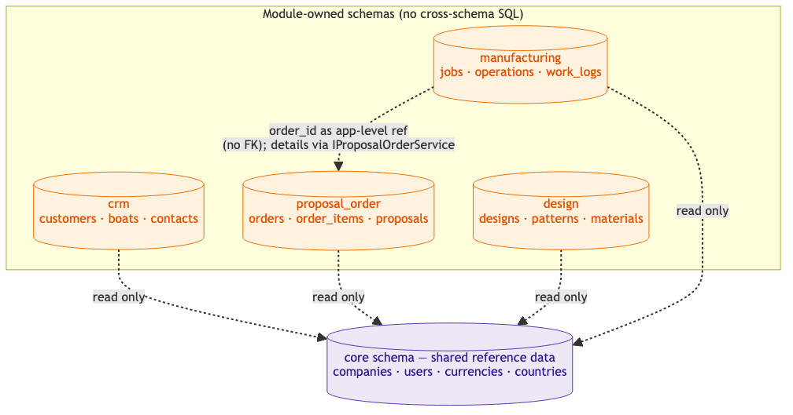

<!-- Source: https://ntg-sailmaking.atlassian.net/wiki/spaces/NTGHELM/pages/2359968/ADR-002+PostgreSQL+with+Per-Module+Schemas (v5, exported 2026-07-06) -->

# ADR-002: PostgreSQL with Per-Module Schemas

**Status**: Ready for ReviewBlue

**Proposed by**: Vu Lam ·

**Contributors**: Vu Lam

**Approved by**: — · pendingYellow

**Links**:

---

## Context

We need a database strategy that:

1. Enforces the module boundary principle from ADR-001
2. Makes it practical to later extract a module into a standalone service with its own DB
3. Avoids the CS problem of everything joined to everything in a single shared schema
4. Works well with a C# backend and Azure

The order number (or equivalent order ID) is a shared key that flows through most modules — this is a legitimate foreign key reference, not a reason to merge schemas.

## Decision

Use **PostgreSQL** as the single database engine. Each domain module gets its own **named schema** (e.g., `crm`, `proposal_order`, `design`, `manufacturing`). Tables in one schema must not be joined directly from another module’s code — cross-module data access goes through the module’s public API (repository/service interface), not SQL.

A shared `core` schema holds reference data that all modules need (companies, users, currencies).

## Schema Diagram

One PostgreSQL instance; each module owns a schema. All modules may **read** `core`; no module reads another module’s schema directly — cross-module access goes through Contracts interfaces.

> **Cross-module access:** ❌ no direct SQL JOINs across module schemas · ✅ via Contracts interfaces (e.g., `ICrmService.GetCustomer`).
>
> **Extraction path:** when a module is extracted to a service, its schema becomes a separate physical database — no code change in the module.

## Rationale

PostgreSQL has strong schema isolation support, excellent performance for this scale, and is well-supported on Azure (Azure Database for PostgreSQL). Per-schema isolation gives a clear boundary: if module A’s code tries to query module B’s tables, it’s immediately visible and reviewable.

Single physical DB keeps operations simple while we’re small. When/if a module needs to be extracted, its schema becomes its own database — the migration path is mechanical.

**Cross-module references** (e.g., `order_id` in manufacturing): stored as application-level references (INT or UUID), never as database foreign keys. The calling module fetches related data via the owning module’s Contracts interface at runtime.

## Accessing Data Across Schemas

“No cross-schema SQL” raises the obvious question: *what do you do when you genuinely need data from several modules at once?* Pick by the shape of the need — do **not** reach for a cross-schema JOIN.

| Need | Mechanism | Notes |
| --- | --- | --- |
| **One related record** (enrich a single entity) | Synchronous Contracts call (`ICrmService.GetCustomer(id)`) | Fine for 1–few lookups. **Avoid in loops** — N calls over N rows is the N+1 trap. |
| **A small set, known ids** | Batch Contracts method (`GetCustomers(ids)`) | Always provide a batch variant alongside the single-id one, precisely to kill N+1. |
| **Aggregation / reporting / dashboards spanning modules** | **CQRS read model** — a denormalized projection maintained from domain events | The right tool for “list orders with customer name + payment + shipping status.” Owns its own schema (e.g. `reporting`), is read-only, and is eventually consistent. See the [Architecture Overview §8](../architecture/overview.md). |
| **Ad-hoc analytics / BI** | Out-of-band: read replica or warehouse ETL | Never let BI tools JOIN across operational module schemas — that re-couples modules through the database. |

**Transaction boundary:** a single business operation writes to **exactly one module’s schema**. Work that must change two modules’ data is coordinated asynchronously (event + the owning module reacting), never a single cross-schema transaction. This is what keeps a module extractable later. (Reliable cross-module writes use the outbox — see [ADR-004](ADR-004-async-messaging-and-outbox.md).)

**Stale/dangling references:** because cross-module references are application-level (no FK), the referenced row can be soft-deleted while a reference still points at it. Consumers must tolerate “referenced entity not found / inactive” rather than assume referential integrity.

## Migrations

Each module owns its schema’s migrations (EF Core, scoped to that schema); the `core` schema is owned by `Helm.Core`. No migration touches another module’s schema. Migrations are backward-compatible (add nullable → backfill → enforce); a column is never dropped until the code that used it is gone.

## Consequences

**Good:**

- Schema per module makes boundary violations visible in code review
- Single DB instance is operationally simple; no distributed transactions needed
- Extraction path to independent DB per microservice is clear and low-risk
- PostgreSQL JSONB support gives richer querying within JSON fields, useful in design/manufacturing modules

**Bad / watch out for:**

- Must actively enforce the no-cross-schema-SQL rule — a linter or architecture test is recommended
- Foreign keys across schemas are possible in Postgres but must be avoided between module schemas (use application-level references only)
- If a module’s data is needed by another module (e.g., order details needed by manufacturing), define a clear read API — don’t shortcut to a DB join

## Alternatives Considered

- **SQL Server**: familiar to NTG’s existing developers and used by all three legacy systems. Rejected: higher licensing cost on Azure; PostgreSQL’s JSONB support is an advantage. The familiarity argument is outweighed by cost and capability. *(Raised as open in Toby’s architecture review; settled here — see Status.)*
- **Separate DB per module from day one**: rejected as over-engineering for current team size; adds operational overhead before we understand the load profile
- **One schema, shared tables**: rejected — this is the CS approach and the root cause of its unmaintainability
