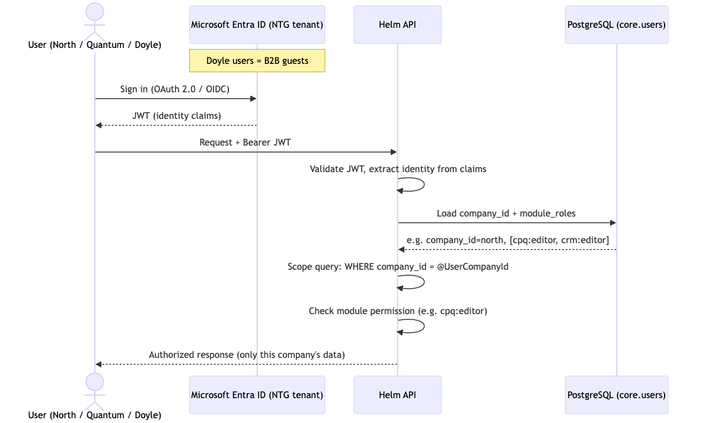

<!-- Source: https://ntg-sailmaking.atlassian.net/wiki/spaces/NTGHELM/pages/2064892/ADR-003+Single+Azure+Tenant+Microsoft+SSO+RBAC (v3, exported 2026-07-06) -->

# ADR-003: Single Azure Tenant, Microsoft SSO, RBAC

**Status**: Ready for Review

**Proposed by**: Vu Lam ·

**Contributors**: Mike Probyn-Skoufa, Vu Lam

**Approved by**: — · pendingYellow

**Links**:

---

## Context

Three companies (North, Quantum, Doyle) plus licensees across ~20 countries will all use the same Helm system. They currently have separate Azure tenants (at minimum, Doyle is on a different tenant to NTG). Users must be isolated — a Doyle user must never see North’s data — but NTG group-level users must be able to see everything for reporting and management.

The existing CS system has an overly complex role/country/module matrix that nobody fully understands and which has become a maintenance burden.

## Decision

All companies are hosted in a **single NTG Azure deployment** (one app, one database). Identity is handled via **Microsoft Single Sign-On (Microsoft Entra ID)**. Cross-tenant access is enabled for Doyle users via Entra B2B guest access or external identities, so they log in with their existing Microsoft credentials.

Authorization is **role-based (RBAC)** with the simplest model that covers real requirements:

- Users are assigned to a **company** (North, Quantum, Doyle, NTG-group)
- Users have a **module role** within that company (e.g., `cpq:editor`, `crm:viewer`)
- NTG group accounts have read/write across all companies
- Licensees are treated as a separate company with their own data isolation

The goal is: if you can see it, you can change it. Viewer roles (`crm:viewer`) are exceptions for specific audit/reporting use cases only — not the default.

## Authentication & Authorization Flow

A user authenticates against Entra ID (Doyle users as B2B guests in the NTG tenant), and Helm validates the resulting token, then scopes every request by `company_id` and checks the module role.

**Authorization model — worked examples:**

| User | `company_id` | Sees | Module roles |
| --- | --- | --- | --- |
| Regular user ([anna@north.com](mailto:anna@north.com)) | `north` | North data only | `cpq:editor`, `crm:editor` |
| NTG group admin ([admin@ntg.com](mailto:admin@ntg.com)) | `ntg` | **All** companies (North, Quantum, Doyle) | `*:admin` (full read/write) |
| Doyle user, B2B guest ([john@doyle.com](mailto:john@doyle.com)) | `doyle` | Doyle data only | same role set as North/Quantum users |

`module_roles` is stored per user in `core.users`; `company_id` scoping is applied at the repository layer on every query. **NTG-group admins** (`company_id = 'ntg'`, role `*:admin`) are the single exception that may read across companies — the repository layer skips the `company_id` filter **only** when the caller carries the NTG-group admin claim. Because this is the one cross-company read path, it must be covered explicitly by the pre-go-live security review (see Consequences) and by automated tests asserting no non-NTG user can ever widen scope.

## Rationale

One deployment = one codebase to maintain, one place to deploy fixes, one set of infrastructure costs. The branding difference (Doyle vs North) is configuration, not separate apps.

Microsoft SSO is already the standard in NTG’s Azure environment. Using it avoids building and maintaining custom auth.

The principle of simplifying the role model comes directly from Mike — the current system’s complexity is a known pain point and we should not reproduce it.

## Token, Claims & Identity Details

**Token model:** the Entra ID access token is validated on every request (JWT Bearer). Identity (object id, email, tenant) comes from token claims; **authorization data (**`company_id`**,** `module_roles`**) is the platform’s own — sourced from** `core.users`**, not the token**, so role changes take effect without re-issuing tokens. The per-request `core.users` lookup is cached (short TTL, e.g. 5 min) to avoid a DB hit per call; cache is keyed by user and invalidated on role change.

**Licensee hierarchy:** licensees are child companies of an owned brand (e.g. `north-switzerland` → parent `north`). A licensee user sees only their own `company_id`; whether a parent-brand user can see child-licensee data is a **business rule for Andrew Schneider** (pricing/discount rules differ) — until confirmed, treat licensee data as isolated like any other company.

**Non-human identities:** background work has no interactive user. Hangfire jobs and the D365 push (ADR-005/006) run under a **service identity** (Azure Managed Identity for Azure resources; a system principal for internal work) and carry an explicit `company_id` context passed by the enqueuing code — they must **not** run with ambient cross-company access.

**Audit:** every NTG-group cross-company read and every authorization decision that widens scope beyond a single `company_id` is written to an audit log (who, when, which company’s data). This is the evidence trail for the data-isolation security review.

## Consequences

**Good:**

- Single deployment, dramatically lower operational cost
- Microsoft SSO is already trusted and used; no custom auth to maintain
- Simplified role model means fewer support tickets and less admin overhead
- NTG group can get aggregated reporting across all companies (currently impossible)

**Bad / watch out for:**

- Data isolation is critical — a bug in the company-scoping logic could expose North data to Doyle users; **security review required** before go-live:

  - **Who**: External security consultant or senior NTG security architect
  - **When**: Before Phase 1 (Doyle) production deployment
  - **Checklist**: Row-level security audit, authorization middleware review, penetration test with cross-tenant B2B users
- Cross-tenant Entra B2B setup needs to be tested with Doyle’s actual tenant (not tested as of intro meeting) — **action item for Phase 1 planning**
- Licensees add a third company type — their discount/pricing rules differ from owned-site rules; confirm treatment with Andrew Schneider before implementing pricing module

## Alternatives Considered

- **Separate deployment per company**: rejected — 3× the infrastructure cost, 3× the deployments, defeats the purpose of a unified system
- **Multi-tenant SaaS architecture**: over-engineered for this use case; the three companies are all under NTG group ownership
- **Custom auth (username/password)**: rejected — adds security maintenance burden; no advantage over Microsoft SSO in an already-Microsoft environment
