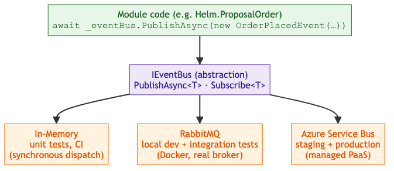

<!-- Source: https://ntg-sailmaking.atlassian.net/wiki/spaces/NTGHELM/pages/2359987/ADR-004+Async+Messaging+Strategy+IEventBus+Abstraction+Outbox+Pattern (v5, exported 2026-07-06) -->

# ADR-004: Async Messaging Strategy — IEventBus Abstraction & Outbox Pattern

This document is currently Ready for ReviewYellow.

## Document Details

| **Attribute** | **Details** |
| --- | --- |
| **Proposed by** | Vu Lam · |
| **Contributors** | Vu Lam |
| **Approved by** | — · pending |
| **Links** | [ADR-005](ADR-005-background-jobs-hangfire.md), [ADR-010](ADR-010-hosting-azure-container-apps.md), [ADR-011](ADR-011-scaling-and-multi-region.md) |

---

## Context

When modules need to communicate asynchronously, two problems must be solved together:

1. **Transport**: what broker do we write module code against? Azure Service Bus (native Azure, no local emulator) and RabbitMQ (Docker-friendly) were both under consideration. Coding against either SDK directly locks us in.
2. **Reliability**: publishing an event and committing a DB write are two separate operations. If the process crashes between them, the event is lost (or a phantom event is published if the order is reversed). This becomes critical when Helm runs as multiple Container Apps instances.

These two problems are solved together — the outbox is the reliability layer on top of the transport abstraction.

## Decision

### Part 1 — IEventBus Abstraction

Define a thin `IEventBus` interface in `Helm.Core`. All modules publish and subscribe through this interface only — never directly against a broker SDK.

Three implementations, selected by config:

| Implementation | Used for | Notes |
| --- | --- | --- |
| **In-memory** | Unit tests; zero-dependency local runs | Synchronous dispatch; no broker needed. **Only valid for single-instance deployments** (tests). |
| **RabbitMQ** | Everyday local development; production option | Run via Docker Compose; real broker behaviour. Required for multi-instance deployments. |
| **Azure Service Bus** | Staging and production (recommended) | Fully managed Azure service. Required for multi-instance deployments. |

Swapping transports is a **config change only** — no module code changes.

**Why a broker (RabbitMQ/Service Bus) in the monolith?** Two critical reasons:

1. **Multi-instance deployment**: Helm runs as **multiple autoscaled instances** (Container Apps replicas). An event published in instance 1 must reach handlers in instances 2 and 3 — in-memory dispatch is limited to one process and cannot deliver across instances.
2. **Event durability and reliability**: In-memory events are:

   - **Lost on crash** (if the process dies before handlers execute, the event is gone)
   - **No retry semantics** (a handler failure = lost event, no dead-letter queue)
   - **No ordering guarantees** across restarts
   - **No poison message handling** (a bad handler kills the process)

   The outbox + broker pattern ensures events survive crashes (persisted in DB transaction), retry on failure, land in a dead-letter queue when exhausted, and preserve ordering where needed.

The broker enables **reliable pub/sub across replicas**, not event-driven projections (which are deferred per [ADR-001](ADR-001-modular-monolith.md) — synchronous reads via Contracts are simpler while sharing a process).

### Part 2 — Transactional Outbox

Events are not published to the broker directly. Instead:

1. The domain event is written to an `outbox` table **in the same DB transaction** as the state change.
2. A background relay (`IHostedService`) polls the outbox, publishes unpublished events via `IEventBus`, then marks them processed.
3. On startup the relay re-processes any unprocessed events (crash recovery).

Each module owns its own outbox table within its schema (e.g., `proposal_order.outbox`).

```sql
CREATE TABLE proposal_order.outbox (
    id           UUID PRIMARY KEY DEFAULT gen_random_uuid(),
    event_type   TEXT NOT NULL,
    payload      JSONB NOT NULL,
    created_at   TIMESTAMPTZ NOT NULL DEFAULT NOW(),
    processed_at TIMESTAMPTZ NULL
);
```
**Idempotency — hard convention**: the relay delivers at-least-once. All event consumers **must be idempotent**. Processing the same event twice must produce the same result. This must appear as a test scenario in every module spec that subscribes to events.

Idempotency is the **consumer’s** responsibility, not the broker’s — do not rely on broker-side duplicate detection as the primary guard (Service Bus dedup is a finite-window backstop only, and the in-memory/RabbitMQ transports don’t offer it). Each consuming module keeps a `processed_events` **table in its own schema** (`event_id UUID PRIMARY KEY, processed_at TIMESTAMPTZ`); the handler inserts the `event_id` and applies its effect in **one transaction**, and a duplicate `event_id` (PK conflict) is skipped. Where the effect is a naturally idempotent upsert keyed on a business key (e.g. CQRS projections, see [overview §8](../architecture/overview.md)), a version-checked upsert is sufficient and the table can be omitted. Purge `processed_events` on the same 30-day cadence as the outbox.

**Multi-instance safety**: use `SELECT ... FOR UPDATE SKIP LOCKED` so competing instances claim distinct batches without double-publishing.

**Cleanup**: purge processed events older than 30 days to prevent unbounded table growth.

## Architecture Diagrams

### Part 1: IEventBus Abstraction

Module code depends only on the `IEventBus` interface; the concrete transport is chosen by configuration per environment.



Transport is selected by config — no module code change:

```json
{ "Messaging": { "Provider": "InMemory | RabbitMQ | AzureServiceBus" } }
```
### Part 2: Transactional Outbox Pattern

The event row is written in the **same transaction** as the business change, so it can never be lost or phantomed. A background relay publishes outbox rows to the broker; consumers must be idempotent because delivery is at-least-once.

bottomEvent Flowfit1

**Guarantees & limits:**

| ✅ Guarantees | ⚠️ Limits |
| --- | --- |
| No lost events (outbox shares the business transaction) | At-least-once delivery → consumers must be idempotent |
| No phantom events (rollback drops the outbox row too) | 1–5s delivery lag → not for synchronous workflows |
| Survives crashes (relay re-processes on startup) | Relay adds an `IHostedService` per publishing module |
| Multi-instance safe (`FOR UPDATE SKIP LOCKED`) |  |

## Rationale

The IEventBus abstraction resolves the “Azure Service Bus vs RabbitMQ” question: both are used, at different stages, with the same module code. RabbitMQ in Docker gives developers real broker semantics (ordering, retries, dead-lettering) locally before touching production.

The outbox makes event publishing atomic with the state change — the only safe approach for a multi-instance deployment. These two patterns are designed to work together and should be implemented as a unit.

**Cleanup**: Processed outbox rows older than 30 days are purged by a Hangfire recurring job (see ADR-005) to prevent unbounded table growth.

## Event Conventions & Failure Handling

**Event naming & catalog:** events are named as past-tense facts — `<Aggregate><PastTenseVerb>` (e.g. `OrderPlaced`, `DesignFinalized`). Each published event type and its consumers are listed in an **event catalog** (in the publishing module’s Contracts project / spec) so the cross-module event surface is discoverable and reviewable — events are part of a module’s public contract, like its interfaces.

**Event versioning:** events are immutable contracts. Evolve them **additively only** — add optional fields; never remove or repurpose a field. A breaking change is a **new event type** (`OrderPlacedV2`); publish both until all consumers migrate, then retire V1. Consumers ignore unknown fields. This keeps producer and consumer independently deployable (essential once modules are extracted).

**Consumer retry & poison messages:** a consumer that throws is retried with exponential backoff (bounded — e.g. 5 attempts). After the limit the message goes to a **dead-letter queue** (native on Service Bus; a dead-letter table for the in-process/outbox path), and an alert fires. DLQ messages are inspected and replayed after the bug is fixed — never silently dropped. Alert if DLQ depth > 0 (prod).

**Relay failure:** if a *publish* fails (broker down), the outbox row stays unprocessed and is retried on the next poll — no event is lost. A row stuck unprocessed beyond a threshold (e.g. 5 min) raises an alert (see [overview runbook](../architecture/overview.md)).

## Consequences

**Good:**

- Module code has no broker dependency — easy to test and swap
- RabbitMQ locally means local dev behaves like production
- No lost or phantom events, even across crashes and instance restarts
- Replay is possible: mark outbox rows as unprocessed to re-drive a consumer

**Bad / watch out for:**

- In-memory implementation is synchronous and hides at-least-once semantics — tests must account for this
- All event consumers must be idempotent — enforce in spec test scenarios and code review
- Outbox relay adds a hosted service per module that publishes events
- Delivery lag = relay polling interval (typically 1–5 seconds); not suitable for anything needing synchronous response
- RabbitMQ in Docker must be documented clearly in onboarding

## Alternatives Considered

- **Code directly against Azure Service Bus**: rejected — no usable local emulator; forces Azure credentials for local dev
- **Code directly against RabbitMQ**: rejected — would require a migration when switching to Service Bus in production
- **Direct publish (no outbox)**: rejected — loses events on crash; not safe for multi-instance deployment
- **MassTransit / NServiceBus**: both support this pattern natively. NServiceBus is commercial. MassTransit is free and well-regarded. **Deferred** — implement a lightweight custom outbox first; **decision point**: revisit this if:

  - We have >5 modules publishing events
  - Dead-letter queue management becomes complex
  - We need saga/orchestration patterns (long-running workflows)
