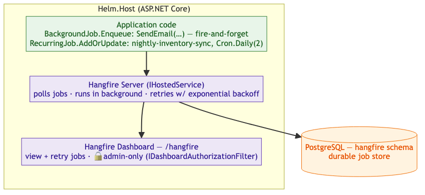

<!-- Source: https://ntg-sailmaking.atlassian.net/wiki/spaces/NTGHELM/pages/2064908/ADR-005+Background+Jobs+Hangfire (v3, exported 2026-07-06) -->

# ADR-005: Background Jobs — Hangfire

Status: Ready for ReviewYellow

| **Attribute** | **Details** |
| --- | --- |
| **Proposed by** | Vu Lam · |
| **Contributors** | Toby Moxham, Vu Lam |
| **Approved by** | — · pending |
| **Links** |  |

---

## Context

Helm needs a background job framework for:

1. **Fire-and-forget with retry**: calls to external services (emails, shipping carrier APIs, and eventually D365 push) that must not block the request and must retry on transient failure.
2. **Scheduled jobs**: nightly tasks such as inventory reconciliation, warranty expiry checks, reminder emails.

The outbox relay (ADR-004) runs as an `IHostedService` and does not need this framework — it is a separate internal mechanism for event publishing only.

## Decision

Use **Hangfire** with PostgreSQL persistence (a `hangfire` schema in the main database).

- Jobs are stored in PostgreSQL — durable across restarts
- Built-in **Hangfire Dashboard** provides visibility into queued, processing, succeeded, and failed jobs
- Configurable retry with backoff covers the fire-and-forget requirement
- Recurring jobs (cron-style) cover the scheduled task requirement
- Hangfire server runs within `Helm.Host`; can be extracted to a dedicated worker process if load grows

The dashboard must be protected behind Entra ID authentication via [ASP.NET](http://ASP.NET) Core Authorization (see example below).

## Architecture Diagram

Application code enqueues jobs; the Hangfire server (hosted in `Helm.Host`) persists, polls, and executes them against the `hangfire` schema, with a dashboard for visibility.



Example job states in `hangfire.job`:

| id | state | invocation | created\_at |
| --- | --- | --- | --- |
| 101 | Enqueued | `SendEmail(42, 1001)` | 2026-06-18 10:00 |
| 102 | Processing | `SyncInventory()` | 2026-06-18 02:00 |
| 103 | Succeeded | `SendEmail(43, 1002)` | 2026-06-18 09:30 |
| 104 | Failed | `PushToD365(order:44)` | 2026-06-18 08:00 |

**Dashboard authentication** — restrict `/hangfire` to authenticated admins:

```csharp
app.UseHangfireDashboard("/hangfire", new DashboardOptions
{
    Authorization = new[] { new HangfireAuthorizationFilter() }
});

class HangfireAuthorizationFilter : IDashboardAuthorizationFilter
{
    public bool Authorize(DashboardContext context)
    {
        var user = context.GetHttpContext().User;
        // Aligns with ADR-003 RBAC: roles live in core.users and are hydrated into the
        // ClaimsPrincipal after authentication (not carried in the Entra token). NTG-group
        // admins hold the "*:admin" module role.
        return user.Identity?.IsAuthenticated == true
            && user.HasClaim("module_role", "*:admin");
    }
}
```
## Operational Conventions

**Job-method versioning (the #1 Hangfire production trap):** Hangfire serializes the *method reference and arguments* into `hangfire.job`. If you rename/move a job method or change its signature, **already-queued jobs from the previous deploy fail to deserialize** and error out. Rules: job method signatures are a contract — evolve them additively (add optional params, don’t remove/reorder); keep job methods in stable, well-known types; for a breaking change, drain the queue before deploy or keep the old method as a shim. Treat job entry points like a public API.

**Idempotency:** Hangfire delivers at-least-once (a job can re-run if the server crashes mid-execution or a retry fires), so every job must be idempotent — same as event consumers in ADR-004.

**Queues & priority:** use named queues to isolate workloads (e.g. `critical` for payment/D365 push, `default`, `low` for reports) so a backlog of low-priority jobs can’t starve time-sensitive ones.

**Poison jobs:** after retries are exhausted a job lands in **Failed** (not silently dropped) and stays until the configured retention elapses. Set **failed-job retention long enough to triage** (failed jobs expire just like succeeded ones), alert on Failed-state growth, and re-queue from the dashboard after a fix.

**Retention:** configure succeeded/failed job expiration deliberately (Hangfire default is ~24h for succeeded, configurable via `WithJobExpirationTimeout`) so `hangfire.*` tables don’t grow unbounded; this is separate from the ADR-004 outbox cleanup.

## Consequences

**Good:**

- Durable job storage — jobs survive process restarts
- Built-in dashboard for monitoring queues and retries without extra tooling
- Simple API; low learning curve
- Handles both fire-and-forget and cron scheduling in one library

**Bad / watch out for:**

- Hangfire Pro features (batches, continuations) require a paid licence; evaluate before using Pro features
- Dashboard must be secured behind auth before go-live (example above shows implementation)
- Heavy jobs in the same process as the API can affect latency under load. **Decision point**: move to a dedicated worker process if:

  - API P95 latency >500ms (tracked via APM)
  - Individual job runtime >10 seconds
  - Background job CPU usage >20% during peak hours
- Jobs must be idempotent — Hangfire can re-enqueue a job if the server crashes mid-execution

## Alternatives Considered

- [**Quartz.NET**](http://Quartz.NET): mature, powerful cron engine; lacks Hangfire’s dashboard; more complex configuration; not required at this stage
- **Azure Functions (timer-triggered)**: adds a separate deployment unit; over-engineered for background tasks within the monolith
- **Custom** `IHostedService` **with** `PeriodicTimer`: sufficient for simple scheduled tasks but provides no persistence, no retry, no dashboard visibility
