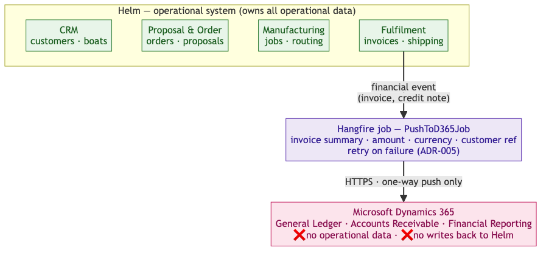

<!-- Source: https://ntg-sailmaking.atlassian.net/wiki/spaces/NTGHELM/pages/2261377/ADR-006+Dynamics+365+as+Finance+Integration+Only (v5, exported 2026-07-06) -->

# ADR-006: Dynamics 365 as Finance Integration Only

## Document Details

| **Attribute** | **Value** |
| --- | --- |
| Status | DeferredYellow — Phase 2 (North migration) |
| Proposed by | Vu Lam · |
| Contributors |  |
| Approved by | — · deferred |
| Links |  |

**Why deferred**: This decision only becomes active when North Sails migrates to Helm. Doyle (Phase 1) has no D365 dependency. Quantum has a clean D365 integration already. Revisit this ADR before starting the North integration work.

---

## Context

North’s CS system is deeply coupled to Microsoft Dynamics 365 (D365). Every order creates items in D365; inventory is managed through D365; the FileMaker planning tool pulls routing data from D365. When an order needs to change company (e.g., delivery country changes), the team must undo all D365 steps and recreate them — described as “impossibly tedious” and estimated at 6 months of work to fix within CS.

Quantum’s QES does not have this dependency — it pushes financial summaries to Dynamics as an external accounting system, treating D365 as a dumb ledger.

## Decision

In Helm, **Dynamics 365 is used for finance reporting only**. Helm owns all operational data: customers, orders, inventory, manufacturing, planning, fulfilment. When an order is invoiced (in Fulfilment) or a financial event occurs, Helm pushes a summary record to D365 via an async integration (using the background job framework from ADR-005). D365 does not push data back to Helm.

**Approval gate**: This ADR requires Andrew Schneider’s sign-off (representing North finance stakeholders) before Phase 2 (North migration) begins.

## Integration Flow

Helm owns all operational data. Only a financial summary (invoice / credit note) is pushed **one-way** to D365 via a Hangfire job; D365 never writes back.

**Key differences from legacy CS:**

| CS (North legacy) | Helm (new system) |
| --- | --- |
| D365 owns inventory | Helm owns inventory |
| D365 owns order routing | Helm owns routing |
| Order change → undo D365 steps → recreate | Order change → no D365 undo needed |
| ~6 months to fix one order’s coupling | Change in seconds |

## Rationale

The Quantum model proves this is viable. Treating D365 as an external accounting system gives Helm full control over its own data and eliminates the cascade of D365 operations that currently makes order changes so painful.

## Integration Reliability

This pushes **financial** records, so correctness matters more than for a typical integration — a duplicated or lost invoice is a real accounting error.

- **Mechanism & state ownership:** the financial event is raised via the outbox (ADR-004) and the actual D365 call runs as a Hangfire job (ADR-005); the **“pushed?” state lives on the source financial record in the** `fulfilment`**/**`finance` **schema** (not in Hangfire), so idempotency and reconciliation survive job-table cleanup.
- **Idempotency:** each financial event carries a stable idempotency key (e.g. invoice id). The push includes it so a Hangfire retry can’t create a duplicate D365 record; if D365 lacks server-side dedupe, Helm checks “already pushed?” before sending. Helm records the push outcome (pushed / acked / failed) against the source record.
- **Reconciliation:** a scheduled job reconciles Helm’s “should be in D365” set against acknowledged pushes and flags discrepancies — covers the gap where a push succeeds but Helm fails to record the ack (otherwise a silent duplicate on retry).
- **Ordering:** related events must apply in order (an invoice before its credit note). Sequence per source entity; don’t assume the queue preserves global order.
- **Failure escalation:** after retries are exhausted, the job lands in Failed (ADR-005) **and raises a finance-visible alert** — a stuck financial push is not allowed to fail silently.
- **Identity:** the push runs under a service identity (ADR-003), not a user, with credentials in Key Vault.
- **Contract:** the pushed payload (invoice summary: amount, currency, customer ref, tax) is a versioned contract agreed with the D365/finance side before North integration.

## Consequences

**Good:**

- Helm controls its own data — no dependency on D365 availability for operational workflows
- Changing an order’s delivery country no longer requires a complex D365 undo/redo
- Follows the proven Quantum pattern

**Bad / watch out for:**

- North’s finance team is accustomed to seeing operational detail in D365; **change management plan required**:

  - Training on new reporting workflows in Helm
  - Parallel running period (TBD: 30/60/90 days?) where both systems are accessible
  - Clear communication on what data lives where
- The D365 push integration must be reliable — invoicing failures need clear error handling and retry (via Hangfire, see ADR-005)
- Andrew Schneider sign-off is required before Phase 2 (North migration) begins — schedule approval meeting during Phase 2 planning

## Alternatives Considered

- **Keep the CS/North D365 integration model**: rejected — it is the direct cause of the “change delivery country” pain point
- **Replace D365 entirely**: out of scope; D365 is required for financial reporting
