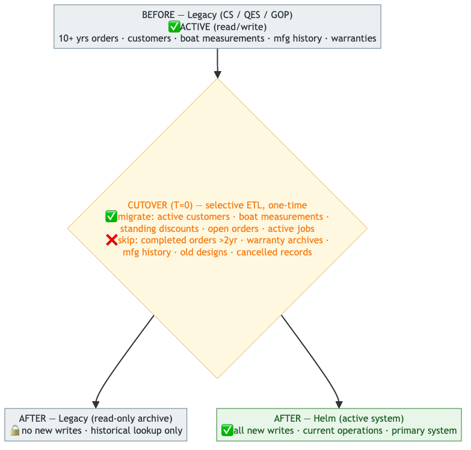

<!-- Source: https://ntg-sailmaking.atlassian.net/wiki/spaces/NTGHELM/pages/2064930/ADR-007+Data+Migration+Strategy (v3, exported 2026-07-06) -->

# ADR-007: Data Migration Strategy

## Document Overview

| **Attribute** | **Detail** |
| --- | --- |
| Status | Principles accepted; per-company ETL detail deferred to each cutover (Doyle = Phase 1 onward) |
| Proposed by | Vu Lam · |
| Contributors | Mike Probyn-Skoufa, Vu Lam |
| Approved by | — · deferred |
| Links |  |

### Why Deferred

The migration approach will be finalised for each company separately as their cutover is planned. The principles below are agreed; the implementation detail (field mapping, ETL tooling, cutover schedule) is scoped per migration project. Revisit before each company’s cutover planning begins.

---

## Context

Three legacy systems hold years of operational data: customer records, historical orders, boat measurements, sail designs, warranty records, manufacturing history. Migrating all of this at go-live would be a 6+ month data mapping project and risks polluting the new system with legacy data quality issues.

However, some historical data is needed for day-one operations:

- Customer repeat orders (re-use previous sail design without redesign)
- Long-term customer discount agreements
- Warranty records (multi-year; needed for after-sales service)
- Boat measurements (to avoid re-measuring returning customers)

## Decision

At go-live, Helm starts **clean** for each company. The legacy system stays live in read-only mode for historical lookups.

A **one-time selective ETL sync** runs at cutover, bringing across only what is needed for day-one operations:

- CRM: customers, boats, contacts, standing discount agreements
- Orders: open/in-progress orders only (not completed orders)
- Manufacturing: active production jobs (not historical archives)

Completed historical orders, warranty records, and archives remain in the legacy system. Full historical migration (if ever warranted) is a separate project, after Helm is proven stable.

## Migration Flow Diagram

At cutover, a one-time selective ETL copies only day-one-operational data into Helm; the legacy system flips to read-only archive for historical lookups.

**Repeat-customer order workflow:** search customer in Helm → view current boats/discounts → if an old order (2+ yrs) is needed, look it up in legacy (read-only) and re-enter required data into the new Helm order.

**Cutover timeline (per company):**

| T-30 days | T=0 (cutover) | T+30 days | T+6 months |
| --- | --- | --- | --- |
| ETL mapping prep | Freeze legacy | Parallel access (Helm + legacy) | Evaluate need for |
| Data-quality audit | Run ETL; go live on Helm; legacy → read-only | User training | full historical migration |

## Rationale

Attempting full data migration at cutover would delay go-live significantly. The Quantum AX→D365 migration broke operations for half a year — a live example of what goes wrong with big-bang data migrations.

## Cutover Mechanics

The principles above leave the risky operational details unstated; each per-company cutover plan must cover:

- **Re-runnable, idempotent ETL:** the ETL can be run repeatedly (dry-run against staging, then for real) without creating duplicates — keyed on a stable legacy id. A dry run on a production copy is mandatory before cutover.
- **ID mapping:** legacy keys rarely match Helm’s. Maintain a `legacy_id → helm_id` mapping per entity for the duration of the cutover so migrated cross-references (customer↔boat↔order) resolve correctly and so a re-run updates rather than duplicates.
- **Delta between freeze and go-live:** the legacy freeze (T=0) and go-live aren’t instantaneous. Define how changes in that window are handled — the simplest is a hard freeze (no legacy writes) with a short, scheduled window; document it.
- **Post-ETL reconciliation:** before declaring go-live, validate counts and key invariants (migrated customers/boats/open-orders vs source; spot-check sample records). Go/no-go gate, not an afterthought.
- **Rollback plan:** if reconciliation fails or go-live is unstable, the fallback is to **unfreeze legacy and abort** (legacy is untouched and still authoritative because Helm started clean). The point of no return is when **new business writes** land in Helm — define that line explicitly, and after it, “rollback” becomes “fix-forward.”

## Consequences

**Good:**

- Go-live is not blocked by a migration project
- Helm’s schema is not polluted by legacy data that doesn’t fit cleanly
- Helm can evolve its schema freely during early phases

**Bad / watch out for:**

- Users must know which system has which data — **training materials must clearly document**:

  - What lives in Helm (current operations, T+0 onwards)
  - What stays in legacy (historical data, T-1 and older)
  - How to access legacy read-only (link, credentials, search process)
- The selective ETL sync still requires field mapping work per company — **estimate 4-6 weeks per company** for mapping, data quality audit, and testing
- Warranty and repeat-customer flows at go-live need a defined process:

  - **Repeat orders**: customer/boat data migrated, old sail designs must be looked up in legacy and re-entered
  - **Warranty claims**: warranty records NOT migrated; users must check legacy system for warranty status
  - **Decision**: confirm this is acceptable with Andrew Schneider during Phase 2 planning

## Alternatives Considered

- **Full migration at cutover**: rejected — too risky; AX→D365 is the cautionary example
- **Strangler fig (extract module by module)**: not applicable for Doyle (nothing to strangle); remains an option for North
- **Start fresh, no migration**: rejected — warranty and repeat-customer workflows depend on history
