<!-- Source: https://ntg-sailmaking.atlassian.net/wiki/spaces/NTGHELM/pages/2064542/NTG+Platform+Architecture+Overview (v12, exported 2026-07-06) -->

# NTG Platform — Architecture Overview


## Problem Summary

Design a production-ready architecture for the **NTG Platform** — a unified sailmaking platform consolidating three legacy systems (North Sails CS, Quantum QES, Doyle GOP) into a single **modular monolith** on Azure, serving all NTG brands from one deployment.

**Recommended shape:** modular monolith, vertical slices, BFF per frontend, monorepo (Nx + nx-dotnet), Azure Container Apps. Start simple; keep clean boundaries so modules can be extracted later only if metrics justify it.

### Decisions of record (ADR map)

This overview is governed by these ADRs. Where a section restates a decision, it cites the ADR; details and alternatives live there.

| Decision | ADR | Covered in |
| --- | --- | --- |
| Modular monolith architecture | ADR-001 | §1, §4, §15 |
| PostgreSQL, schema per module | ADR-002 | §4, §11 |
| Single Azure tenant, Entra SSO, RBAC | ADR-003 | §13 |
| Async messaging — `IEventBus` + outbox | ADR-004 | §5, §6, §11 |
| Background jobs — Hangfire | ADR-005 | §12 |
| Dynamics 365 finance-only (Phase 2) | ADR-006 | — |
| Data migration strategy (Phase 2+) | ADR-007 | — |
| **BFF per frontend, not API gateway** | ADR-008 | §1 |
| **Monorepo — Nx + nx-dotnet** | ADR-009 | §3 |
| **Hosting — Azure Container Apps (not AKS day 1)** | ADR-010 | §10, §11 |
| **Scaling & multi-region (active-passive DR)** | ADR-011 | §12 |

---

## 1. High-Level Architecture

> **Note:** The specific frontend split (three apps: Internal Platform, Customer Portal, Factory Kiosk) is a **working assumption** based on initial requirements. The final number of frontend applications and their boundaries will be determined during product discovery, informed by user workflows, deployment constraints, and authentication requirements. The architectural principle remains: **one BFF per frontend application**, regardless of how many frontend apps we ultimately build.

Three frontends, each with its own **Backend-for-Frontend (BFF)** layer, talking to one modular-monolith API. No separate API gateway — the BFF *is* the composition layer.

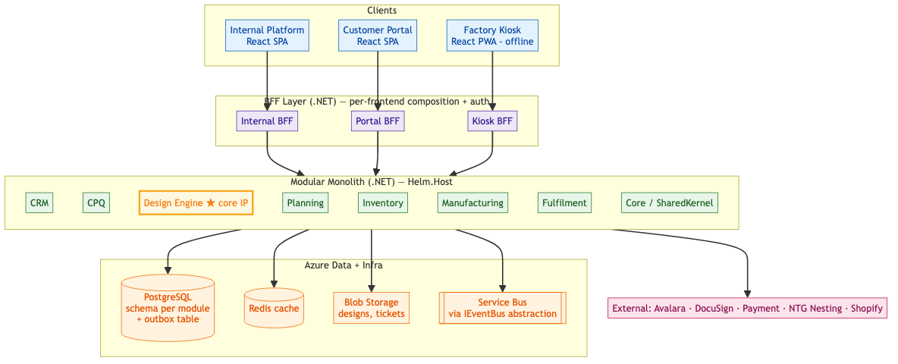
> **Messaging (per** [**ADR-004**](../adr/ADR-004-async-messaging-and-outbox.md)**):** modules publish/subscribe only through an `IEventBus` abstraction in `Helm.Core` — never against a broker SDK. Transport is selected by config: **in-memory** (tests), **RabbitMQ** (local dev via Docker), **Azure Service Bus** (recommended for staging/prod as a managed service). The abstraction means you can run RabbitMQ in production too if you move off Azure — it’s a config-only change, no module code changes. Every event is first written to a **PostgreSQL outbox table, in the same transaction** as the state change; a background relay then publishes it. The outbox is required from day 1 because the monolith runs as **multiple autoscaled instances** — an event must be published exactly once, not once per replica.

**Why BFF, not API Gateway:**

|  | API Gateway | BFF (recommended) |
| --- | --- | --- |
| Role | Routes to many backend services | Composes/shapes responses for one frontend |
| Fit for monolith | Adds a hop with nothing to route | Tailors payloads per client (kiosk ≠ portal) |
| Auth | Centralised but generic | Per-audience (Entra B2B vs B2C) |
| When NTG needs a gateway | Only after extracting services | — |

The current three-frontend split reflects anticipated user needs: the **Kiosk** must work offline on low bandwidth (small, denormalized payloads); the **Portal** is customer-facing (B2C auth, limited data); the **Internal** app is data-rich. *Product discovery may adjust these boundaries*—what matters is that each frontend has its own BFF tailored to its audience. If you later need external API management (rate limiting, API keys for Shopify), add **Azure API Management** in front — that’s a gateway for *external* consumers, separate from the BFF concern.

### Frontends scale with audience, not with module

A common question: *should each domain module (CRM, Design, Inventory…) get its own frontend and its own BFF?* **No.** Frontends and BFFs are sliced by **audience**, not by domain module — these are different axes:

| Axis | Slices by | How many | Example (subject to product discovery) |
| --- | --- | --- | --- |
| **Domain module** | Business capability (backend) | ~10 | CRM, Design Engine, Inventory, Manufacturing |
| **Frontend app + BFF** | User audience | 3 (working assumption) | Internal Platform, Customer Portal, Factory Kiosk |

A single screen almost always spans several modules — e.g. the production dashboard reads CRM (customer), Design (status), Inventory (cloth), and Manufacturing (progress). Composing across modules for one screen is exactly what a BFF is *for*.

**The rule:**

> Backend slices by **domain** (module per domain). Frontend slices by **audience** (app per audience). BFF = one per frontend. Domain modules are **folders inside an app**, never separate apps or separate BFFs.
```
N frontends ──> N BFFs ──> 1 monolith (10 module folders)
 (audience)     (compose)        (domain)

where N = number of distinct user audiences (3 is the current working assumption)
```
**Two anti-patterns this rejects:**

- **Frontend per module** = micro-frontends (shell app, module federation, cross-app routing, shared-auth plumbing). It buys independent *frontend* deploys — which a lean team doesn’t need and pays dearly for in complexity and runtime cost.
- **BFF per module** = just that module’s API with extra hops. It loses composition and pushes aggregation into the browser → N chatty calls per screen, each frontend re-implementing the join.

Instead: **one app per audience** (modules live as isolated folders/libs inside it — see §3, §4), and **one BFF per frontend** that composes across whatever modules its screens need.

---

## 2. Module Map (Value Chain)

Modules are sequenced by data dependency. The **Design Engine** sits at the centre — its output contract defines structures all downstream modules conform to, so it’s built first.

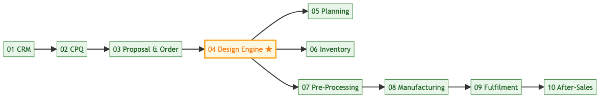

**Each module owns:** frontend screens, API endpoints, business logic, its own PostgreSQL schema (`crm`, `design`, …), and its tests. Shared reference data (companies North/Quantum/Doyle, users, currencies) lives in the `core` schema, readable by all.

---

## 3. Monorepo Strategy (Nx + nx-dotnet)

One repo, orchestrated by **Nx**. Nx understands the dependency graph and runs only what changed (`nx affected`), which keeps CI fast as the repo grows.
```
ntg-platform/
├── nx.json                       # Nx workspace config
├── apps/                         # one deployable app PER AUDIENCE (not per module)
│   ├── web-internal/             # React — internal platform
│   ├── web-portal/               # React — customer portal
│   ├── web-kiosk/                # React PWA — factory kiosk
│   └── api/                      # .NET host (Helm.Host) + 3 BFFs (one per frontend)
├── libs/
│   ├── api/                      # .NET projects (nx-dotnet)
│   │   ├── Helm.Core/            # SharedKernel
│   │   ├── Helm.Crm/  Helm.Crm.Contracts/
│   │   ├── Helm.Design/  Helm.Design.Contracts/   ★ core IP
│   │   └── ...
│   └── web/
│       ├── shared-ui/            # design system
│       ├── api-client/           # GENERATED from backend OpenAPI
│       └── feature-*/            # per-MODULE FE code (feature-crm, feature-design, …)
├── infra/                        # Azure Bicep IaC
└── tools/                        # generators, scripts
```
Domain modules on the frontend are **folders/libs** (`libs/web/feature-*`), consumed by whichever audience apps need them — not separate deployable apps. They follow the same isolation rule as backend modules (§4): **feature libs must not import from each other**; shared UI goes in `shared-ui`. This gives module boundaries without the deploy/runtime cost of micro-frontends.

**Closing the FE↔BE gap — one source of truth for contracts:** the backend publishes an OpenAPI spec; CI generates a typed TypeScript client into `libs/web/api-client`. Frontends never hand-write DTOs — they import the generated types. A contract change in .NET surfaces as a TypeScript compile error in the affected frontend.

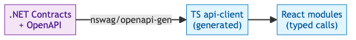

---

## 4. Module Boundaries & Internal Layers

Inside each .NET module, Clean Architecture; dependencies point inward.

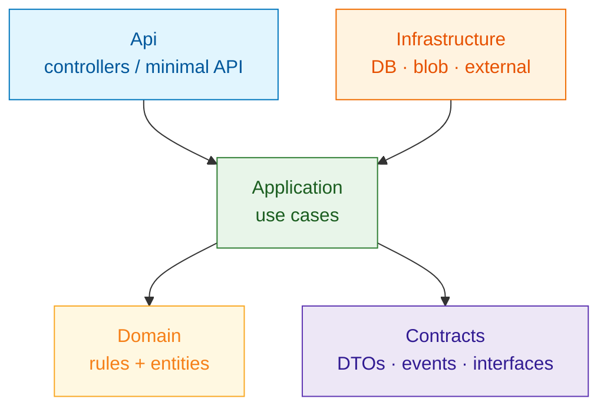
**Dependency rules (non-negotiable):**

1. Other modules depend on `*.Contracts` **only**, never on implementations.
2. No circular Contract dependencies.
3. A module never queries another module’s schema. `core` is read-only-shared.

**Not every module needs all layers** — match complexity:

| Module complexity | Layers | NTG example |
| --- | --- | --- |
| Simple CRUD | Api + Infrastructure | Translation settings, apparel catalog |
| Some logic | + Application | Planning calendar |
| Rich domain | Full Clean Architecture | **Design Engine**, CPQ, Inventory |

**Enforcement (key points — don’t rely on discipline):**

- **NetArchTest** in CI fails the build if a module references another module’s implementation, or if Contracts form a cycle. *(One test per rule; build-breaking.)*
- Keep `Helm.Core` (SharedKernel) small — alert if it exceeds ~2000 LOC; it tends to become a dumping ground.

```csharp
// Architecture test — the one rule that matters most
Types.InAssembly(typeof(DesignModule).Assembly)
    .Should().NotDependOnAny("Helm.Crm", "Helm.Inventory")   // implementations
    .GetResult().IsSuccessful.Should().BeTrue();
```
---

## 5. Cross-Module Communication

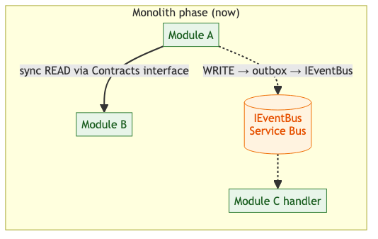

**The rule:** cross-module **reads** may be synchronous (via a Contracts interface). Cross-module **writes** are always asynchronous (events). This keeps each module a single transaction boundary and avoids distributed transactions.

| Need | Mechanism | NTG example |
| --- | --- | --- |
| Read another module’s data | Sync call via Contracts | CPQ reads boat spec from `ICrmService` |
| Trigger work elsewhere | Publish event (via outbox → `IEventBus`) | `DesignFinalized` → Inventory reserves cloth |
| Cross-module reporting | CQRS read model (§8) | Sail production dashboard |

**Outbox pattern** ([ADR-004](../adr/ADR-004-async-messaging-and-outbox.md)) — the event row is written in the *same transaction* as the business change; a background relay (`IHostedService`) publishes it via `IEventBus` using `SELECT … FOR UPDATE SKIP LOCKED` so competing instances never double-publish. Guarantees no lost events across crashes and multiple instances. Transport (in-memory / RabbitMQ / Service Bus) is a **config choice**, so module code stays broker-agnostic and is unchanged on later service extraction.

**Why a real broker in the monolith?** Two critical reasons:

1. **Multi-instance deployment**: Even though modules share one process, that process runs as **N autoscaled instances** (Container Apps replicas). An event published in instance 1 must reach handlers in instances 2 and 3 — in-memory dispatch can’t cross process boundaries.
2. **Event durability**: In-memory events are lost on process crash (before handlers execute), have no retry/dead-letter semantics, and can’t survive restarts. The outbox + broker ensures events are never lost — the event is persisted in the same transaction as the state change, and the broker provides retry, dead-letter queues, and ordered delivery.

The broker (RabbitMQ/Service Bus) is for **reliable pub/sub across instances**, not for event-driven projections (those are deferred per [ADR-001](../adr/ADR-001-modular-monolith.md) §Cross-Module Communication — synchronous reads via Contracts are simpler while one process).

---

## 6. Transactions & Sagas

Single module = one DB transaction. Multi-module workflows = a **saga** with compensation (no 2PC).

**NTG flow — when a design is finalized:**

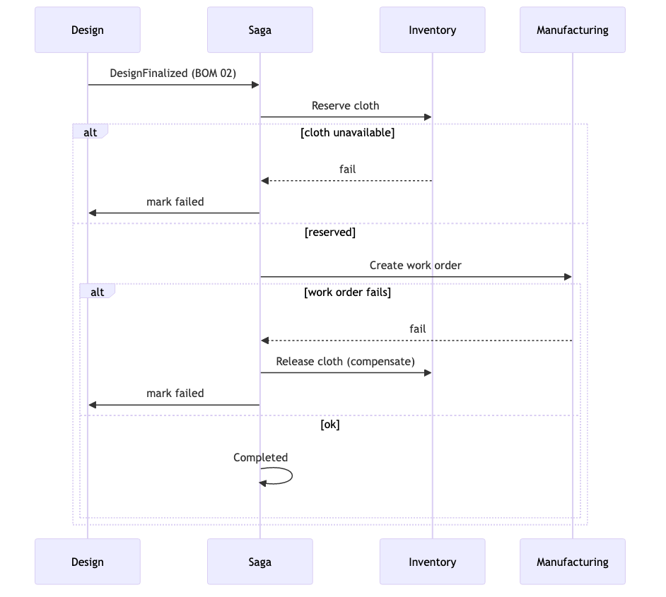

**Key points (don’t hand-roll this):**

- Persist saga state (`InProgress` / `Compensating` / `Completed` / `Failed`) for recovery.
- Idempotency key per saga; retry with exponential backoff; compensate in reverse order.
- Set a timeout → auto-compensate; alert on sagas stuck > 10 min.
- **Framework:** sagas layer on top of the `IEventBus`/outbox foundation (ADR-004). A custom lightweight orchestrator is the default; **MassTransit** is the fallback if saga/orchestration needs grow (the explicit decision point flagged in ADR-004). Either way, sit on the same transport config (in-memory → RabbitMQ → Service Bus) — same saga code. Do not hand-roll broker plumbing.

---

## 7. API Design Standards (essentials)

- **Versioning:** URL (`/api/v1/...`); support previous version ≥6 months; log clients on old versions with a `Sunset` header.
- **Errors:** RFC 7807 Problem Details, always with `traceId`.
- **Pagination:** `?page=&pageSize=&sortBy=&sortDir=`; envelope with `items` + `totalCount`.
- **Idempotency:** `Idempotency-Key` header on writes; cache `(key → response)` 24h (in Redis/Postgres). Service Bus duplicate-detection adds an infra-layer backstop, and all event consumers must be idempotent (ADR-004).
- **Long-running ops** (e.g. nesting, PDF render): `202 Accepted` + operation URL to poll → `303` to result.
- **Contracts, never EF entities** exposed to clients.

---

## 8. CQRS Read Models (cross-module reporting)

Don’t join across schemas. A projection subscribes to events from several modules and maintains one denormalized read model.

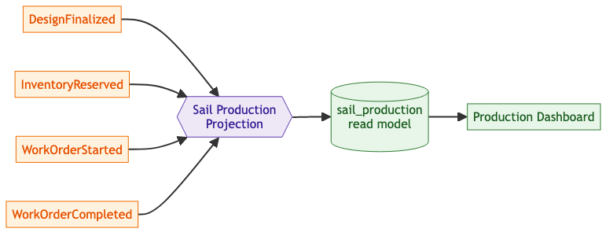

**Key points:**

- Handlers are **idempotent + version-checked** (ignore stale/duplicate events).
- Provide a **rebuild** path (replay events into a new table, atomic swap) for schema changes or bugs.
- Monitor **projection lag**; alert if > 5s. Accept that the read model is eventually consistent.

```csharp
// The essential handler shape — guard, then upsert
if (existing is not null && existing.Version >= evt.Version) return; // stale/dup
upsert(new SailProductionReadModel { SailId = evt.SailId, /* … */, Version = evt.Version });
```
---

## 9. Testing & Code Quality

Goal: high confidence, fast feedback, gated in CI on both stacks. Nx runs only affected projects.

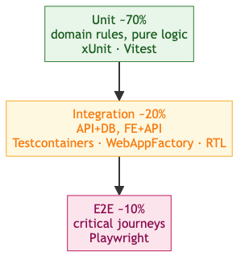

**Backend (.NET):**

| Concern | Tool |
| --- | --- |
| Unit / integration | xUnit + FluentAssertions |
| Real DB in tests | Testcontainers (PostgreSQL) |
| API tests | `WebApplicationFactory` |
| Architecture rules | NetArchTest (boundary enforcement) |
| Coverage | Coverlet → fail CI under threshold (start 60%, raise over time) |

**Frontend (React/TS):**

| Concern | Tool |
| --- | --- |
| Unit / component | Vitest + React Testing Library |
| E2E | Playwright (incl. Kiosk offline scenarios) |
| Lint / format | ESLint + Prettier, TypeScript strict (no `any`) |
| Coverage | Vitest c8 → CI threshold |

**Static analysis & quality gates (both stacks):**

- **SonarQube/SonarCloud** quality gate on every PR (bugs, code smells, coverage, duplication) — blocks merge on regression. *(Free tier ≤50k LOC.)*
- **Pre-commit hooks** (Husky + lint-staged): format, lint, fast unit tests on staged files.
- **Dependabot** for dependency/security updates.
- **Contract tests** at module seams so a Contracts change can’t silently break a consumer.

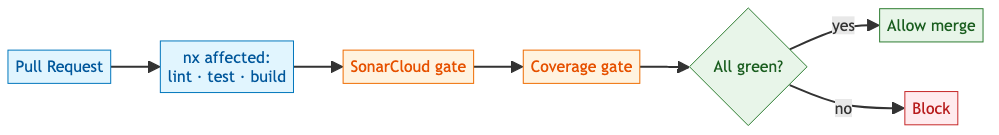

---

## 10. CI/CD, Environments & Hosting

### Hosting: Azure Container Apps (not K8s on day 1)

The backend + BFFs run on **Azure Container Apps** (managed containers, KEDA autoscale, revisions for blue-green, cheap per-PR apps) — **not** AKS, which is overkill for a single monolith and a lean team. Frontends deploy to **Azure Static Web Apps** (static bundles + free per-PR previews). AKS is adopted only if a service is later extracted (§15); ACA images run unchanged on AKS. **Decision, rationale, and alternatives:** [**ADR-010**](../adr/ADR-010-hosting-azure-container-apps.md)**.**

### Environments

SoW: start with **Local · Dev · Prod**, grow to **Local · Dev · Sandbox · Staging/UAT · Prod**.

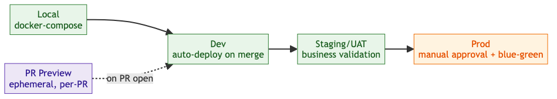

### Branching & PR preview environments

- Feature branch → PR to `dev`. PR triggers `nx affected` checks **and** spins up an **ephemeral environment**:

  - Frontend: Static Web Apps preview (automatic, free).
  - Backend: an ACA app (or revision) named `pr-<number>`, torn down when the PR closes.
  - A throwaway PostgreSQL (containerized or a cheap Flexible Server DB) seeded with synthetic data.
- Reviewers click a live URL on every PR. This is high-value for a stakeholder-heavy project (Anna, Andrew can see features live).
- Releases cut to `release/*`, promoted through UAT, merged to `main`. Protected branches require ≥1 approval.

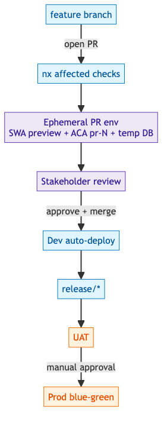

### Pipeline (Azure Pipelines) — stages

`Build (nx affected) → Quality gate (Sonar+coverage) → Deploy Dev → Integration tests → Deploy UAT → Manual approval → Deploy Prod (blue-green)`.

Migrations run via EF Core per module; **backward-compatible only** (add nullable → backfill → enforce; never drop a column until old code is gone). Secrets come from **Key Vault via Managed Identity** — never in config.

---

## 11. Azure Infrastructure (IaC)

All resources in **Bicep** under `infra/`, parameterized per environment. Nothing provisioned by hand (an Azure subscription restructure is expected — IaC is the only safe path).

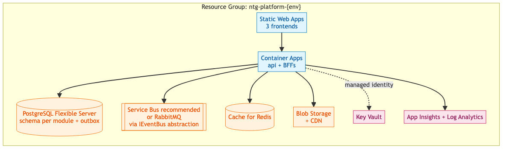

**Azure specifics that matter:**

- **PostgreSQL Flexible Server** — connection pooling in the string; zone-redundant HA in prod; automated backups. **Hosts each module’s outbox table.**
- **Blob Storage** — soft delete (30d), lifecycle → Cool tier for old designs, CDN for customer documents.
- **Key Vault** — Postgres/Service Bus/Avalara/DocuSign secrets; Managed Identity access; rotation.
- **App Insights** — auto-instrumentation + distributed tracing via `traceparent`; custom telemetry on saga transitions, design finalization, kiosk events.
- **Service Bus** ([ADR-004](../adr/ADR-004-async-messaging-and-outbox.md)) — the **recommended** `IEventBus` transport for **staging/prod** due to being fully managed (RabbitMQ via Docker locally, in-memory in tests). RabbitMQ is also production-ready if you prefer self-managed or need Azure portability — the `IEventBus` abstraction makes this a config-only swap. Features: topics+subscriptions for pub/sub, duplicate detection, DLQ per subscription, sessions for per-sail ordering.

---

## 12. Scaling & Resilience

A modular monolith does **not** limit scaling. What enables scaling is a **stateless app tier**; the hard parts are the database and background jobs, not the monolith shape. **Full decision, multi-region tradeoffs, and alternatives:** [**ADR-011**](../adr/ADR-011-scaling-and-multi-region.md)**.** This section is the connective summary.

### Scaling axes

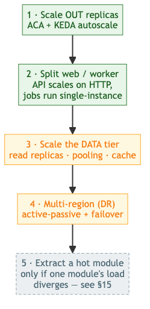

### Auto-scale (day 1)

- **ACA + KEDA** scales the monolith 1→N replicas on HTTP concurrency, CPU, or a custom metric (e.g. outbox depth). Each replica is a full copy of `Helm.Host` behind ACA ingress; scale-to-zero available for non-prod.
- **Tradeoff (accepted):** you scale the **whole monolith** as a unit — you cannot scale just the Design module. For NTG’s load (tens–hundreds of users) you’ll run 2–10 replicas long before any module needs isolation. When one module’s load genuinely diverges, that’s an extraction trigger (§15).

### The stateless-app prerequisite

Replicas only work if no replica holds unique state. Checklist:

| Don’t keep in-process | Put it in |
| --- | --- |
| Session / auth state | Redis (or stateless JWT) |
| Uploaded files, generated PDFs | Blob Storage |
| In-memory caches that must agree | Redis (with event-driven invalidation, §13) |
| Scheduled / background work | A single-execution worker (below) |

### Background jobs across replicas (the real gotcha)

The outbox dispatcher and saga processor must run **once**, not once-per-replica. Two clean options:

1. **Hangfire** (per ADR-005) — storage-level locks guarantee a job runs on only one server even with N replicas. Solves it with no extra infra.
2. **Web/worker split** — run two ACA apps off the **same image**: an HTTP-scaled `api` and a single-instance (or queue-depth-scaled) `worker` hosting outbox + sagas. Cleaner separation and independent scaling.

> Either way: handlers must be **idempotent** (§8) so a retried or duplicated message is safe.

### Multi-cluster

For a monolith, “multi-cluster” = multiple **ACA environments**. Avoid it *within* a region (ops cost, little benefit). It becomes real only as a **per-region** step (below), or for **hard per-company isolation** (compliance / noisy-neighbour) — `company_id` is the natural partition axis if ever needed (likely YAGNI). True AKS fleet/multi-cluster is post-extraction only.

### Multi-region & data residency (target: active-passive DR)

Multi-region target is **active-passive disaster recovery**, not active-active (Postgres is single-writer — active-active would need regional sharding or multi-master, overkill for NTG). Designed-for now, built when warranted: stateless app deployable to region B, **Postgres geo-replication** + failover runbook, **GRS Blob**, **Azure Front Door** in front from day 1 so adding region 2 is config. **Decide early — data residency:** if EU licensees require in-region data, choose the `company_id`/region partition strategy up front (the one retrofit-expensive decision). Full tradeoffs and the scaling ladder: [**ADR-011**](../adr/ADR-011-scaling-and-multi-region.md)**.**

### Frontend bundling

- **Route/module code-splitting** — lazy-load each `feature-*` lib so users download only the modules they open (matters most for the 10-module Internal app and the bandwidth-sensitive Kiosk).
- Shared chunk for `shared-ui` + `api-client`.
- **Kiosk PWA** precaches its bundle via service worker → runs offline on factory tablets.

---

## 13. Cross-Cutting Concerns (condensed)

| Concern | Approach |
| --- | --- |
| **Auth** | Entra ID SSO (B2B employees) + Entra External ID/B2C (Portal customers); JWT bearer; RBAC roles (Sales, Designer, Factory Operator, Finance, Admin, Customer); module policies (`Design.Edit`). |
| **Multi-company isolation** | Every company-owned row carries `company_id` (North/Quantum/Doyle + licensees); repository base class scopes **every** query by `company_id`; integration tests assert no cross-company leakage. |
| **Observability** | Structured logs + correlation IDs; RED metrics per module; OpenTelemetry traces. |
| **Caching** | Redis (sessions, hot data) + in-memory (reference data, design rules); event-driven invalidation (e.g. BOM 02 finalized → invalidate cloth cache). |
| **Validation** | FluentValidation at the boundary; business rules in Domain returning `Result<T>`. |
| **SharedKernel** | Auth middleware, logging, tracing, Problem Details, event-bus abstractions, common value objects. Kept small. |

---

## 14. Non-Functional Targets

| Operation | p95 | Notes |
| --- | --- | --- |
| Read by id | < 50ms | 1 DB round-trip |
| Read list (filtered) | < 100ms |  |
| Write | < 100ms | 1–2 round-trips |
| Write + side effects | < 200ms | event published async |
| Complex aggregation | < 500ms | serve from read model |
| Long report / nesting | async (202) | poll for result |
| FE page load (p75) | < 2s |  |

**Security baseline:** OWASP Top 10 mitigations (parameterized queries, short-lived JWT + refresh, TLS 1.3, authorize every endpoint, sanitized React output, Dependabot). Secrets only in Key Vault.

---

## 15. Evolution Path (extract only when justified)

Stay a modular monolith until **2+** of these fire for a module:

| Trigger | Threshold |
| --- | --- |
| Merge conflicts | > 50% of that module’s PRs |
| Deploy divergence | module wants to ship > 2× monolith cadence |
| Team size | 2+ teams on one module |
| Traffic divergence | > 10× average module traffic |
| CI build time | monolith build > 15 min |
| Tech constraint | needs a different runtime |

Extraction is **strangler-fig**: in-process Contracts call → HTTP; shared schema → dedicated DB; route a slice of traffic, monitor, cut over. The **async event path ports cleanly** — cross-module events already run over `IEventBus`/Service Bus, so that part needs no change (the payoff of ADR-004). The **sync read path does not**: a good in-process interface is usually not a good service interface ([Fowler](https://martinfowler.com/articles/microservices.html)). Fine-grained Contracts reads (e.g. `ICrmService.GetBoatSpec`) become chatty, latency-sensitive network calls and need redesign on extraction. Two options, **chosen per read**: keep it a synchronous network call to the owning service (simplest, single source of truth — wrap in timeout/retry/circuit-breaker + cache), or move to an event-fed local read projection (for hot-path or availability-critical reads — at the cost of eventual consistency). Don’t default to replicating data you can just ask for. See [ADR-001 §On extraction](../adr/ADR-001-modular-monolith.md). Scope this read-interface rework into any extraction estimate. Cost is real (~20–40h setup + ongoing ops + infra), so don’t extract for fashion. Amazon/Shopify stayed monolithic for years — clean boundaries are what make later extraction cheap.

---

## 16. Operational Runbook (top scenarios)

| Symptom | First check | Fix |
| --- | --- | --- |
| **Saga stuck** `InProgress` >10m | `core.saga_state` for old `InProgress` rows | retry (reset count), force-compensate, or manual-complete after verifying steps |
| **Read model stale** | diff source vs read model row | rebuild projection (replay) or backfill one id |
| **Outbox not draining** | unpublished rows > 5m old; find poison msg (retry\_count>5) | move poison → dead-letter, restart processor |
| **Migration half-applied** | `__EFMigrationsHistory` vs actual schema | roll back history row + down script, or fix-forward |
| **High latency** p95>500ms | `pg_stat_statements`, look for N+1 | add `Include`/projection, index, cache |

Prevention across all: timeouts + alerts, idempotent handlers, backward-compatible migrations, load test before prod, DLQ alerting.

---

## 17. Decision Summary

| Question | Decision | Rationale |
| --- | --- | --- |
| Monolith vs microservices | **Modular monolith** | Lean team, fastest to value; extract later if metrics demand |
| API gateway vs BFF | **BFF per frontend** | 3 frontends with different needs; no service mesh to route |
| Frontend decomposition | **App per audience; modules as folders** (not micro-frontends) | 3 audiences with different constraints; folder isolation gives module boundaries without deploy/runtime cost |
| Repo layout | **Monorepo (Nx + nx-dotnet)** | One graph, `affected` builds, shared generated client |
| FE/BE contract sharing | **OpenAPI → generated TS client** | Single source of truth; breaking changes caught at compile time |
| Hosting | **Azure Container Apps + Static Web Apps** | Containers + autoscale + PR envs without K8s ops |
| K8s/AKS | **Not day 1** | Adopt only when services are extracted |
| Messaging | `IEventBus` **+ outbox; Service Bus in prod** (ADR-004) | Broker-agnostic code; exactly-once across autoscaled instances |
| Testing | **Vitest/RTL/Playwright + xUnit/Testcontainers/NetArchTest, Sonar gate** | Confidence on both stacks, fast via `affected` |
| PR environments | **SWA preview + ephemeral ACA app + temp DB** | Stakeholders review features live |
| Auto-scale | **ACA + KEDA, stateless app, jobs on Hangfire** | Scale whole monolith out; single-execution background jobs |
| Multi-region | **Active-passive DR (not active-active)** | Postgres geo-replica + Front Door failover; active-active overkill for NTG |
| Data residency | **Partition by** `company_id`**/region — decide early** | Only retrofit-expensive scaling decision; everything else is incremental |

## Glossary

| Acronym | Expansion | Meaning in this doc |
| --- | --- | --- |
| **NTG** | North Technology Group | Parent company; the platform owner |
| **CS / QES / GOP** | (legacy system names) | Legacy systems being replaced — North Sails (CS), Quantum (QES), Doyle (GOP) |
| **BFF** | Backend for Frontend | A per-frontend .NET layer that composes/shapes API responses for one audience |
| **PWA** | Progressive Web App | The Factory Kiosk app — installable, works offline |
| **RBAC** | Role-Based Access Control | Permission model (Sales, Designer, Operator, …) |
| **B2B / B2C** | Business-to-Business / -Consumer | Entra ID (employees) vs Entra External ID (customers) |
| **DTO** | Data Transfer Object | Shape returned by the API (never EF entities) |
| **RFC 7807** | (IETF standard) | Problem Details — the standard JSON error format |
| **CQRS** | Command Query Responsibility Segregation | Separate write model from read (reporting) model |
| **BOM** | Bill of Materials | Sailmaking materials list (BOM 01 → 02 → 03 across the value chain) |
| **DDD** | Domain-Driven Design | Modeling approach (bounded contexts) |
| **DLQ** | Dead-Letter Queue | Where un-processable messages land |
| **OWASP** | Open Worldwide Application Security Project | Source of the Top 10 security checklist |
| **UAT** | User Acceptance Testing | Staging environment for business validation |
| **IaC** | Infrastructure as Code | Azure resources defined in Bicep |
| **RTL** | React Testing Library | Frontend component testing tool |
| **N+1** | (query anti-pattern) | One query per row instead of a single join |
| **RED** | Rate, Errors, Duration | Per-module metrics method |
| **EF Core** | Entity Framework Core | .NET ORM + migrations |

### Azure services

| Acronym | Azure service | Role here |
| --- | --- | --- |
| **ACA** | Azure Container Apps | Hosts the .NET API + BFFs (containers, autoscale, PR envs) |
| **SWA** | Azure Static Web Apps | Hosts the three React frontends + free per-PR previews |
| **AKS** | Azure Kubernetes Service | *Not used day 1* — only if services are later extracted |
| **Entra ID** | Microsoft Entra ID (formerly Azure AD) | Identity / SSO provider |
| **Service Bus** | Azure Service Bus | `IEventBus` transport in staging/prod (RabbitMQ local, in-memory tests) — ADR-004 |
| **Key Vault** | Azure Key Vault | Secret storage (accessed via Managed Identity) |
| **Blob Storage** | Azure Blob Storage | Files: designs, work tickets, certificates |
| **App Insights** | Azure Application Insights | Telemetry, distributed tracing |
| **KEDA** | Kubernetes Event-Driven Autoscaling | Autoscaler ACA uses under the hood |
| **HPA** | Horizontal Pod Autoscaler | K8s autoscaling (mentioned in the AKS comparison) |

## References

DDD (Evans) · Clean Architecture (Martin) · Building Microservices & Monolith to Microservices (Newman) · Vertical Slice Architecture (Bogard) · CQRS (Young) · Saga (Garcia-Molina) · Outbox (Richardson). Azure: Container Apps, Service Bus, Static Web Apps, Bicep docs.
